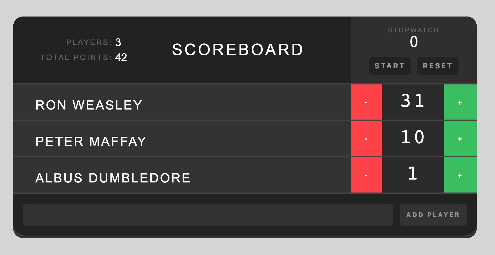

# Scoreboard

## Django

- Framework für Python
- CMS
- Instagram, Pinterest, Artio, Mozilla

### Installieren für Python3:

Virtuelle Umgebung:
``` python
> python3 -m venv myvenv # Umgebung erstellen
> source myvenv/bin/activate # Umgebung aktivieren
```

Installieren von Django:
``` python
> sudo pip3 install --upgrade pip # Checken für ein pip Upgrade (sudo mit -H flag möglich)
> pip3 install Django # Django installieren (Bestimmte Version: pip install Django==2.0.3)
```

### Project erstellen:
``` python
> django-admin startproject mysite . # mysite ist der Name der Seite
```

### App erstellen:
``` python
> django-admin startapp yourapp
```

### Datenbanken:
``` python
> ./manage.py makemigrations
> ./manage.py migrate
```

### Einstellung Konfigurieren:
- LANGUAGE_CODE (z.B. zu 'de-ch')
``` python
LANGUAGE_CODE = 'de-ch'
```
- TIME_ZONE (z.B. zu 'Europe/Berlin')
``` python
TIME_ZONE = 'Europe/Berlin'
```
- STATIC_ROOT (für Daten wie Javascipt, CSS und HTML)
``` python
STATIC_ROOT = os.path.join(BASE_DIR, 'static')
```
- ALLOWED_HOSTS
``` python
ALLOWED_HOSTS = ['127.0.0.1', '.pythonanywhere.com'] # optional auch andere wie Heroku
```
- INSTALLED_APPS name der App hinten anhängen (z.B. 'yourapp',)
```python
INSTALLED_APPS = [
  '...',
  'yourapp',
]
```

### Server zum Laufen bringen:
``` python
> python manage.py runserver # oder
> ./manage.py runserver # oder
> python manage.py runserver 0.0.0.0:8080 # oder
> python manage.py runserver 0:8000
```
Server Aufrufen:  
http://127.0.0.1:8000/

### Superuser erstellen:
```
> python3 manage.py createsuperuser
```
Auf Superuser zugreifen:  
http://127.0.0.1:8000/admin/

(webadmin;webadmin@scoreboard.de;admin1234#)

### REST Framework:
```
> pip3 install djangorestframework
```

### Nützliche Links:
Django einrichten:  
https://tutorial.djangogirls.org/  
React mit Django:  
https://www.techiediaries.com/create-react-app-django/  
http://www.django-rest-framework.org/tutorial/quickstart/  

------------------------------


